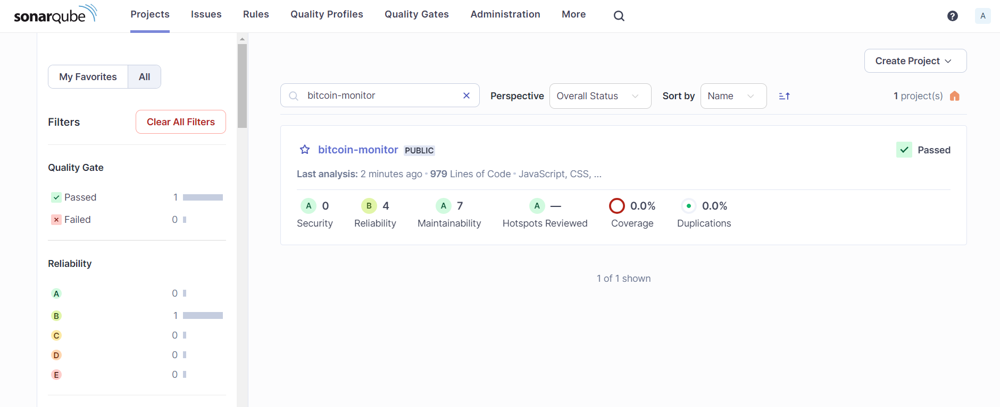
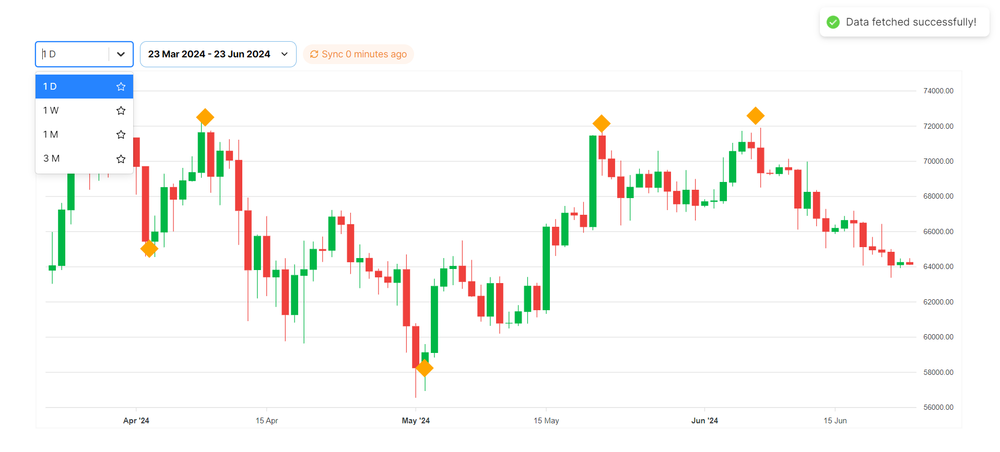

# Bitcoin Price Monitoring Dashboard - ReactJs App

### Code Quality - Sonarqube




### Dashboard Page
This project is a responsive ReactJs application designed for monitoring Bitcoin prices. It features real-time data updates and visualizes historical Bitcoin price data using candlestick charts. The application is built using React, Redux, and Axios, and it follows the given technical requirements.

Dashboard access: http://localhost:5173


## Table of Contents

- [Features](#features)
- [Technologies Used](#technologies-used)
- [Getting Started](#getting-started)
  - [Prerequisites](#prerequisites)
  - [Installation](#installation)
- [Configuration](#configuration)
  - [.env File](#env-file)
  - [Changing the API URL](#changing-the-api-url)
- [Usage](#usage)
  - [Interacting with the Dashboard](#interacting-with-the-dashboard)
- [Marker Functionality](#marker-functionality)
- [API](#api)

## Features

- **Responsive Design:** Adaptable layout for web and mobile devices.
- **Real-Time Data:** Periodically fetches and displays historical Bitcoin price data.
- **Candlestick Charts:** Visualizes price data using interactive candlestick charts.
- **Date Range Filter:** Allows users to select a specific date range to view Bitcoin prices.
- **Candle Size Filter:** Users can choose the candle size (1D, 1W, 1M) for the chart.
- **Last Update Info:** Displays the time of the last data update and allows users to manually refresh data.
- **Marker Functionality:** Users can place and remove markers on the chart to highlight specific price points.

## Technologies Used

- JavaScript
- ReactJs: JavaScript library for building user interfaces.
- Redux: State management library.
- Axios: For making HTTP requests.
- npm: Node package manager.

## Getting Started

To get a local copy up and running, follow these steps.

### Prerequisites

- Node.js and npm installed on your machine.

### Installation

1. Download the repo
2. Install NPM packages:
   ```sh
   npm install
   ```
3. Start the development server:
   ```sh
   npm start
   ```

## Configuration

### .env File

The application uses a `.env` file to manage configuration settings. Create a `.env` file in the root directory of your project and add the following variables:

- `REACT_APP_API_URL`: URL of the API endpoint to fetch Bitcoin price data.
- `REACT_APP_UPDATE_INTERVAL`: Interval (in minutes) at which the application updates the price data.

Example `.env` file:
`makefile
    REACT_APP_API_URL=https://api.example.com/bitcoin-prices
    REACT_APP_UPDATE_INTERVAL=15
    `

### Changing the API URL

To change the API URL from which the application fetches data, update the `REACT_APP_API_URL` variable in the `.env` file.

## Usage

After starting the development server, you can access the application in your web browser at `http://localhost:5173`.

### Interacting with the Dashboard

- **Select Date Range:** Use the date picker to select the range of dates for which you want to view Bitcoin prices.
- **Change Candle Size:** Use the dropdown menu to select the candle size (1D, 1W, 1M).
- **Manual Data Refresh:** Click on the "Last Update" timestamp to manually refresh the data.

## Marker Functionality

Users can place and remove markers on the candlestick chart to highlight specific price points such as the highest or lowest prices in the selected date range. Markers are displayed as yellow diamonds on the chart and can be interacted with as follows:

Web Version:

- **Place Marker**: Left-click on the desired point on the chart.
- **Remove Marker**: Right-click on the existing marker.
- **Move Marker**: Left-click and drag the marker to a new position.

Mobile Version:

- **Place Marker**: Tap on the desired point on the chart.
- **Remove Marker**: Drag the marker off the screen to delete it.

## API

The application fetches Bitcoin price data from a specified API endpoint. Ensure that the API returns data in the expected format for the application to function correctly.

Example API response:

```json
[
  {
    "date": "2023-01-01",
    "open": 29000,
    "high": 29500,
    "low": 28500,
    "close": 29050
  },
  {
    "date": "2023-01-02",
    "open": 29050,
    "high": 29200,
    "low": 28800,
    "close": 29100
  }
  // Additional data points...
]
```
